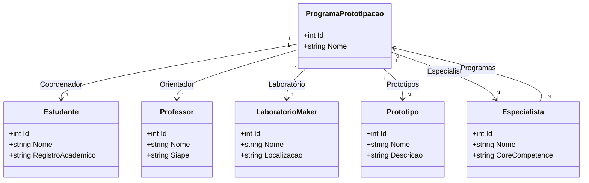
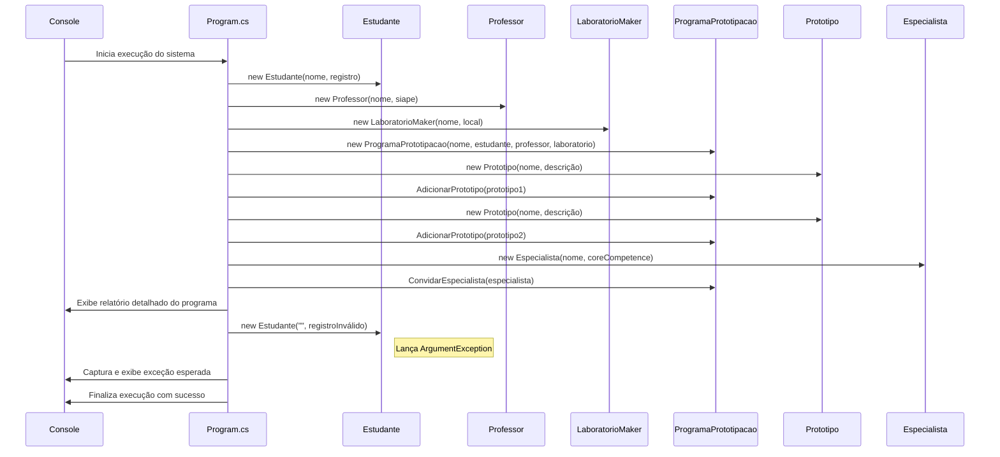

# SistemaLaboratorioAcademico

## Visão Geral

SistemaLaboratorioAcademico é um sistema de prova de conceito para modelar um ambiente acadêmico de prototipação, onde um estudante coordena um programa de prototipação com um professor orientador, um laboratório maker, protótipos em desenvolvimento e especialistas convidados.

## Modelo de Domínio



## Fluxo de Inicialização



## Tabela de Rastreabilidade

| Documento | Descrição |
| --- | --- |
| `01_entidade_estudante.md` | Entidade Estudante |
| `02_entidade_professor.md` | Entidade Professor |
| `03_entidade_laboratorio_maker.md` | Entidade LaboratorioMaker |
| `04_entidade_programa_prototipacao.md` | Entidade ProgramaPrototipacao |
| `05_entidade_prototipo.md` | Entidade Prototipo |
| `06_associacao_programa_prototipos.md` | Associação entre ProgramaPrototipacao e Prototipo |
| `07_entidade_especialista.md` | Entidade Especialista |
| `08_associacao_muitos_para_muitos.md` | Associação N:N entre ProgramaPrototipacao e Especialista |
| `09_execucao_sistema_em_memoria.md` | Cenário de execução em memória do sistema |
| `10_documentacao_readme_e_diagramas.md` | Documentação da geração do README e diagramas |

## Instruções de Execução

Abra um terminal no diretório do projeto SistemaLaboratorioAcademico.

## Pré-requisitos

.NET 10 SDK instalado — necessário para compilar e executar o projeto.

Git — para clonar e versionar o repositório.

IDE/Editor de código: Visual Studio Code (com extensões C#) ou Visual Studio 2022.

Antes de executar, compile o projeto para restaurar dependências e validar a compilação:

```bash
dotnet build
```

Depois de compilado com sucesso, execute o sistema:

```bash
dotnet run
```

O sistema será iniciado em memória e exibirá o relatório do programa de prototipação e a validação de invariantes.

Observação: o projeto foi construído para .NET 10.0, portanto certifique-se de ter o SDK apropriado instalado.
